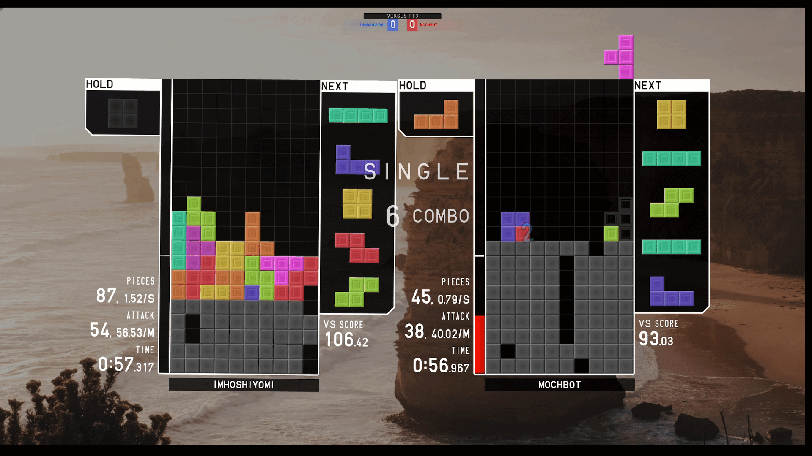
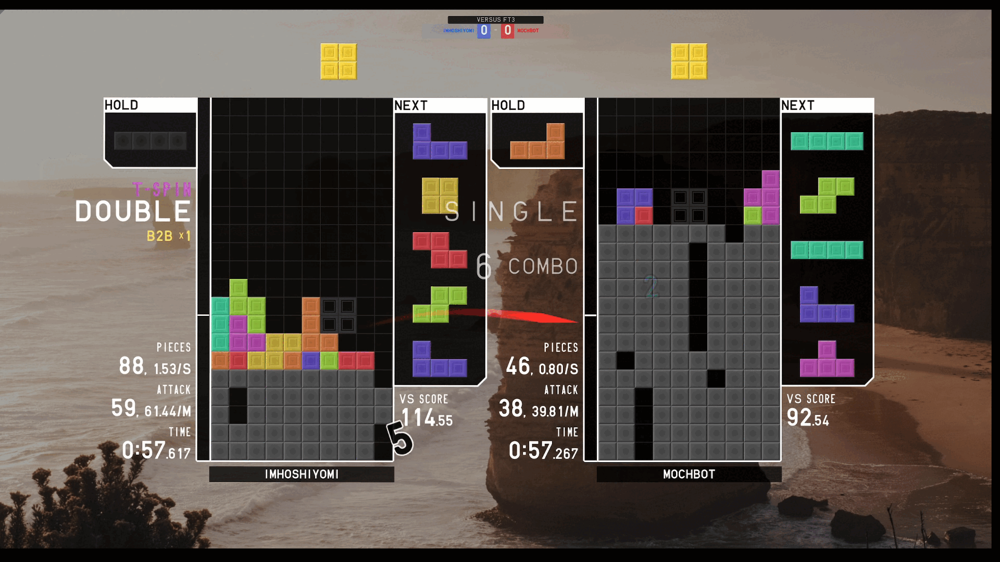

# Final project proposal

## 遊戲名稱：方塊遊戲

## 遊戲基本構成

- 遊戲主體
  以俄羅斯方塊為主題，每次消行都會對於路上的敵人造成傷害，敵人攻擊的時候你會收到垃圾排。

> 垃圾排是灰色方塊，從底下往上長。每橫排都有一個缺口，只要補滿缺口就能消排。  
> 詳見概念圖

- 傷害計算

  - [參考Tetris Guideline](https://harddrop.com/wiki/Tetris_Guideline) (<https://harddrop.com/wiki/Tetris_Guideline>) (Can't find a way to make pandoc parse the hyperlink correctly so I pasted it raw)

  - Combo table  
    (此表B2B部份不會加入)  
    
  - Spins  
    T spin有加成攻擊  
    T spin single : 2 damage  
    T spin double : 4 damage  
    T spin triple : 6 damage  
  - Garbage cancellation  (只要消到garbage就會+1攻擊)  
  - Back-to-Back bonus
    (Back-to-Back 的意思是連續兩次消行都是用Tspin或是Tetris消排)

    | b2b | extra damage|
    | :--------------: | :---------------: |
    | 0-1 | 0 |
    | 2-3 | 1 |
    | 3+ | 2 |

  - All clear (perfect clear, 消完場上所有方塊)
    +10 damage + damage of whatever causes all clear

- Mechanics

  - SRS+ kick (旋轉判定系統，能夠讓一些方塊轉進某些特定的洞裡)
  - 7 bag system  
  生成方塊時，一次生成所有種類(7種)的方塊，打亂順序後打包一起加進queue中。  
  例：一次生成{TSOJILZ}然後照順序加進queue中
  - Configurable controls (能夠調整方塊位移速度以及remap按鍵)
  - Ghost block (目前的方塊會顯示一個顏色較淡的版本在降到最低點的時候會放的位置)
  - Hold block (可以暫存方塊，只能存一個，當暫存中有方塊且按下hold時會交換現有的跟暫存的方塊)
  - Next block (顯示接下來五個方塊)

- 其他數值計算
  - 已放置方塊數(Pieces)
  - 方塊數/秒(PPS pieces per second)
  - 攻擊數/分(APM attack per minute)
  - 經過時間
  - 攻擊數/方塊數(APP attack per piece)

## 遊戲音效

Dr Ocelot for the soundtrack zenith-tower-ost.  
[zenith-tower-ost](https://merch.tetr.io/zenith-tower-ost/) (<https://merch.tetr.io/zenith-tower-ost/>)

Sound effects are from TETR.IO.

## 概念圖

攻擊概念（旁邊的對打的人改為敵人的動圖）

垃圾排是底下灰色的方塊

（當然美術不會這麼有料，頂多像[jstris](https://jstris.jezevec10.com/)( <https://jstris.jezevec10.com/> )而已）
